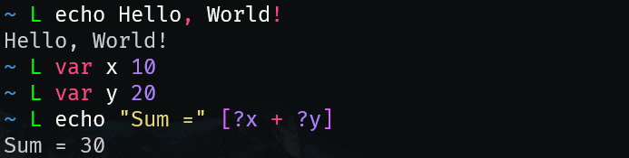

# 🦁 LiON language 

- LiON is a Node Oriented programming language made to be simple and fun to use. Nodes can represent many programming concepts such as `variables`, `functions`, `builtins` and many others.



- Today, the interpreter is written in pure Python, with the code being compiled first to JSON (LiON Compiled Format) then, read and executed by the parser, which, takes care of tree/node operations while also interacting with python.


## Sample scripts and Documentation
- LiON stores samples inside the [samples](./LiON/scripts/samples) directory `%/scripts/samples/`.

- For the formal documentation (indev), please see [this file](./LiON/assets/doc/liondoc.md)

- For the LiON's Last Commit Changelog or (LLVC), see [this file](CHANGELOG.md)

## Installation
First you got to clone this repository to a new installation folder using:
```bash
git clone https://github.com/rkhue/lion-lang.git
```

After that, go to the directory and make sure that all dependencies are installed:
```bash
cd lion
pip3 install -r requirements.txt
```

Then, run the `console.py` python script with the command:
```bash
python3 lionc.py -i
```

*Have fun!* Now you are inside the interactive REPL for the language, the LiON shell or LSI, type in `linos` to see all nodes inside the tree
available for you to use!

> You may start simple, by typing in `echo hello world!`, if you want to dive deeper into coding
with LiON, you may consult the documentation [here](./LiON/assets/doc/liondoc.md)

## Update
To update LiON to the latest version in the GitHub repo.
1. Execute the following command in your LSI
    ```lion
    sh git fetch origin main
    ```
2. Restart your LSI
## Coming soon
- A more detailed documentation (English and Brazilian Portuguese)
- VSCode extension

## License
This project is licensed under the [GNU-GPLv3](LICENSE). See this [notice](./LiON/assets/conf/notice.txt)

## Author and Copyright notice
* LiON Copyright (C) 2024
* By Felipe Fernandes, [rkhue](https://www.github.com/rkhue) at GitHub
